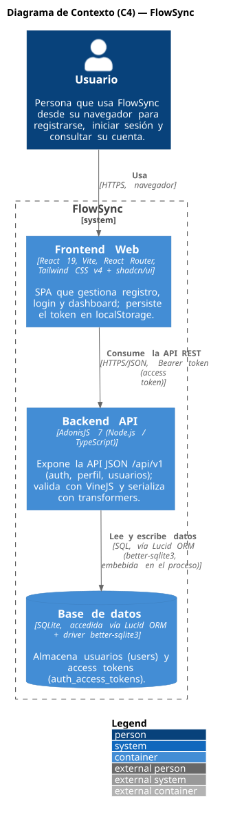
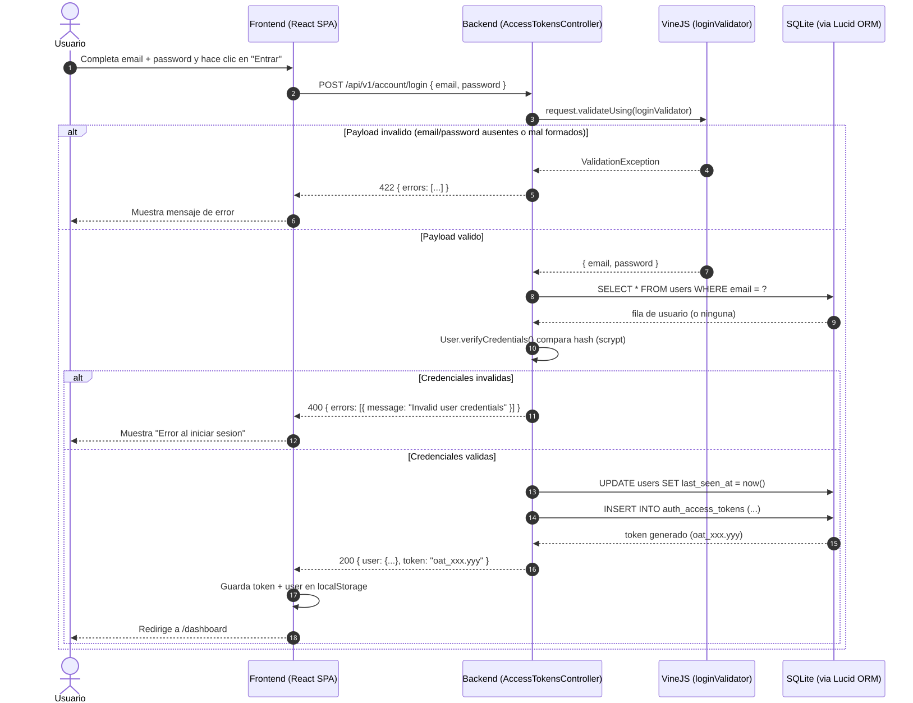
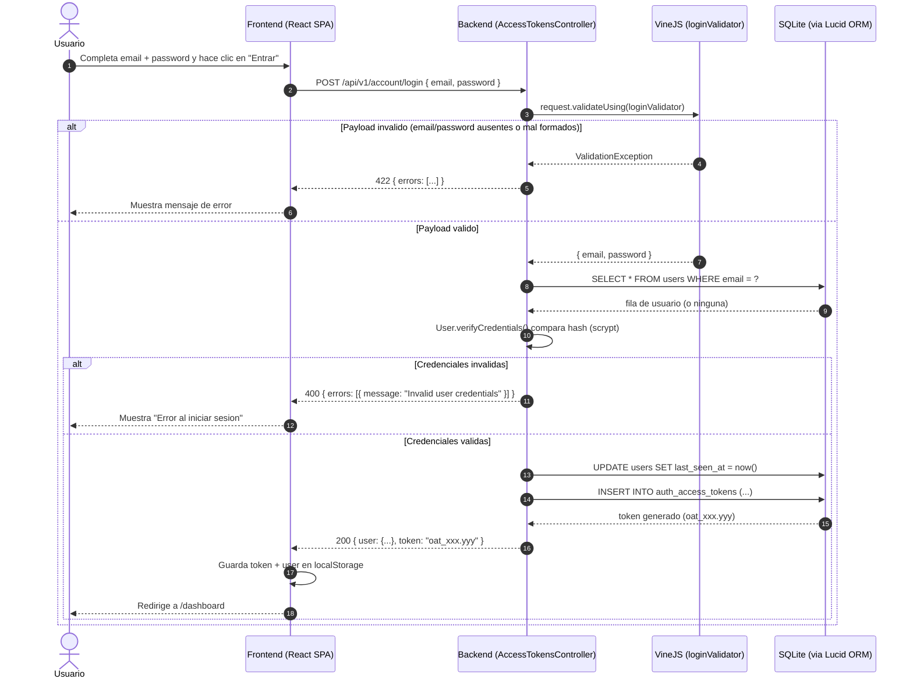

# full-stack-adonisjs-master

Starter kit full-stack con autenticación por **access tokens**. Repo hilo conductor
del máster **AI4Devs** (LIDR). Monorepo con backend y frontend independientes.

```
full-stack-adonisjs-master/
├── backend/      AdonisJS 7 + Lucid + SQLite + VineJS + @adonisjs/auth
├── frontend/     React 19 + Vite + React Router + Tailwind v4 + shadcn/ui
├── openspec/     Configuración de OpenSpec (flujo /opsx:*)
├── docs/         Documentación del producto (PRD.md, ADRs, diagramas)
├── CLAUDE.md     Memoria de proyecto para copilotos de IA
└── README.md
```

## Requisitos

- **Node.js 24** o superior (AdonisJS 7 lo requiere). Comprueba con `node -v`.
- npm 10+.

## Arranque rápido

### 1. Backend (`http://localhost:3333`)

```bash
cd backend
npm install
cp .env.example .env
node ace generate:key      # rellena APP_KEY en .env
npm run migration:run      # crea las tablas users + auth_access_tokens
npm run dev                # servidor con HMR
```

### 2. Frontend (`http://localhost:5173`)

```bash
cd frontend
npm install
cp .env.example .env       # VITE_API_URL ya apunta al backend
npm run dev
```

Abre `http://localhost:5173`, regístrate, entra al dashboard y cierra sesión.

## Endpoints del backend

| Método | Ruta | Auth | Descripción |
|---|---|---|---|
| GET | `/api/v1/health` | — | Liveness (`{ status: 'ok' }`) |
| POST | `/api/v1/account/register` | — | Registro → `{ user, token }` |
| POST | `/api/v1/account/login` | — | Login → `{ user, token }` |
| POST | `/api/v1/account/logout` | Bearer | Revoca el token actual |
| GET | `/api/v1/account/profile` | Bearer | Usuario autenticado |
| GET | `/api/v1/users` | Bearer | Lista de usuarios |
| GET | `/api/v1/users/:id` | Bearer | Usuario por id |

> El endpoint `GET /api/v1/users/active` se implementa en vivo en la Sesión 3.

## Workflow con OpenSpec

Flujo spec-driven con Claude Code o Cursor:

```
/opsx:propose "añadir endpoint X"   # genera proposal + specs + tasks
/opsx:apply                          # implementa según las tasks
/opsx:archive                        # archiva el cambio aplicado
```

La configuración vive en `openspec/config.yaml`. Los comandos y skills se
instalaron en `.claude/` y `.cursor/`.

## Arquitectura

### Diagrama de contexto (C4)

Construido con [C4-PlantUML](https://github.com/plantuml-stdlib/C4-PlantUML). Muestra
al usuario y los tres bloques principales del sistema (frontend, backend y base de
datos), junto con la naturaleza de cada conexión.



<details>
<summary>Ver código fuente (PlantUML)</summary>

```plantuml
@startuml C4_Context_FlowSync
!include https://raw.githubusercontent.com/plantuml-stdlib/C4-PlantUML/master/C4_Container.puml

LAYOUT_WITH_LEGEND()

title Diagrama de Contexto (C4) — FlowSync

Person(usuario, "Usuario", "Persona que usa FlowSync desde su navegador para registrarse, iniciar sesión y consultar su cuenta.")

System_Boundary(flowsync, "FlowSync") {
    Container(frontend, "Frontend Web", "React 19, Vite, React Router, Tailwind CSS v4 + shadcn/ui", "SPA que gestiona registro, login y dashboard; persiste el token en localStorage.")
    Container(backend, "Backend API", "AdonisJS 7 (Node.js / TypeScript)", "Expone la API JSON /api/v1 (auth, perfil, usuarios); valida con VineJS y serializa con transformers.")
    ContainerDb(database, "Base de datos", "SQLite, accedida vía Lucid ORM + driver better-sqlite3", "Almacena usuarios (users) y access tokens (auth_access_tokens).")
}

Rel(usuario, frontend, "Usa", "HTTPS, navegador")
Rel(frontend, backend, "Consume la API REST", "HTTPS/JSON, Bearer token (access token)")
Rel(backend, database, "Lee y escribe datos", "SQL, vía Lucid ORM (better-sqlite3, embebida en el proceso)")

@enduml
```

</details>

### Diagrama de secuencia — Login (`POST /api/v1/account/login`)

Verificado en [mermaid.live](https://mermaid.live/). Cubre el flujo completo,
incluyendo el camino feliz y los dos caminos de error (validación de payload con
VineJS y credenciales inválidas contra la base de datos).



<details>
<summary>Ver código fuente (Mermaid)</summary>



</details>

